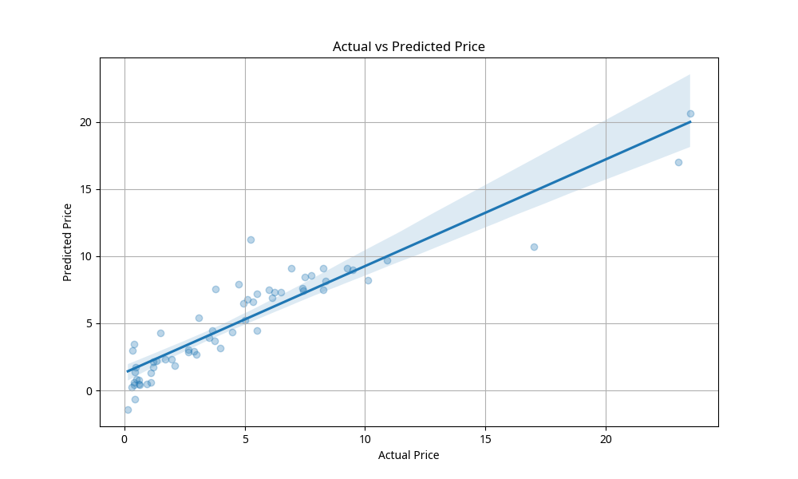

# Projet de Prédiction du Prix des Voitures avec Machine Learning

Ce projet a été amélioré pour fournir une solution robuste et professionnelle pour la prédiction du prix des voitures d'occasion. Il utilise des techniques de machine learning pour estimer le prix de vente basé sur diverses caractéristiques.

## Table des Matières

1.  Introduction
2.  Structure du Projet
3.  Préparation des Données et Ingénierie des Caractéristiques
4.  Entraînement et Évaluation du Modèle
5.  Utilisation du Modèle
    *   Prédiction via Script Python
    *   Prédiction via API Flask
6.  Visualisation des Résultats
7.  Améliorations Apportées
8.  Conclusion et Perspectives

## 1. Introduction

Le marché des voitures d'occasion est dynamique et complexe, avec des prix influencés par une multitude de facteurs tels que l'âge du véhicule, le kilométrage, le type de carburant, et l'état général. Ce projet vise à développer un modèle de régression linéaire capable de prédire avec précision le prix de vente des voitures d'occasion, offrant ainsi un outil précieux pour les acheteurs et les vendeurs.

## 2. Structure du Projet

Le dépôt contient les fichiers et répertoires suivants :

*   `data/car data.csv`: Le jeu de données original utilisé pour l'entraînement du modèle.
*   `car_price_prediction.py`: Script Python pour le prétraitement des données, l'entraînement du modèle de régression linéaire, l'évaluation et la sauvegarde du modèle entraîné. Il génère également un graphique de visualisation.
*   `car_price_model.pkl`: Le modèle de régression linéaire entraîné, sauvegardé au format pickle, prêt à être utilisé pour des prédictions.
*   `app.py`: Une application web Flask qui expose une API RESTful pour la prédiction du prix des voitures en utilisant le modèle entraîné.
*   `requirements.txt`: Liste des dépendances Python nécessaires pour exécuter le projet.
*   `README.md`: Ce fichier de documentation détaillé.
*   `real_vs_predicted_prices.png`: Graphique généré montrant la relation entre les prix réels et les prix prédits par le modèle.
*   `test_api.py`: Script Python pour tester l'API Flask.

## 3. Préparation des Données et Ingénierie des Caractéristiques

Le jeu de données `car data.csv` contient des informations sur différentes voitures. Les étapes de préparation des données incluent :

*   **Chargement des données**: Le fichier CSV est chargé dans un DataFrame Pandas.
*   **Ingénierie des caractéristiques**: Une nouvelle caractéristique, `Car_Age`, est créée en soustrayant l'année de fabrication de la voiture de l'année actuelle. Cette caractéristique est cruciale car l'âge d'un véhicule a un impact significatif sur son prix.
*   **Suppression des colonnes non pertinentes**: Les colonnes `Car_Name` et `Year` sont supprimées car `Car_Name` n'est pas directement utilisable par le modèle (trop de catégories uniques) et `Year` est remplacée par `Car_Age`.
*   **Encodage des variables catégorielles**: Les variables catégorielles telles que `Fuel_Type`, `Selling_type`, et `Transmission` sont converties en format numérique à l'aide de l'encodage one-hot (`pd.get_dummies`). L'option `drop_first=True` est utilisée pour éviter la multicolinéarité, ce qui est une bonne pratique en régression.

## 4. Entraînement et Évaluation du Modèle

Un modèle de régression linéaire est utilisé pour prédire le prix de vente (`Selling_Price`).

*   **Division des données**: Les données sont divisées en ensembles d'entraînement (80%) et de test (20%) pour évaluer la performance du modèle sur des données non vues.
*   **Entraînement du modèle**: Le modèle de régression linéaire est entraîné sur l'ensemble d'entraînement.
*   **Évaluation**: La performance du modèle est évaluée à l'aide du coefficient de détermination R² (`r2_score`). Un score R² élevé indique que le modèle explique une grande partie de la variance des prix de vente.
*   **Sauvegarde du modèle**: Le modèle entraîné est sauvegardé au format `pickle` (`car_price_model.pkl`) pour une utilisation future sans avoir besoin de le ré-entraîner.

## 5. Utilisation du Modèle

### Prédiction via Script Python

Vous pouvez utiliser le modèle entraîné directement dans un script Python pour faire des prédictions. Assurez-vous d'avoir le fichier `car_price_model.pkl` dans le même répertoire ou de spécifier le chemin correct.

```python
import pickle
import pandas as pd
from datetime import datetime

def predict_car_price(present_price, driven_kms, fuel_type, selling_type, transmission, owner, year):
    model = pickle.load(open("car_price_model.pkl", "rb"))

    current_year = datetime.now().year
    car_age = current_year - year

    input_data = pd.DataFrame([[present_price, driven_kms, owner, car_age, 0, 0, 0, 0]],
                               columns=["Present_Price", "Driven_kms", "Owner", "Car_Age",
                                        "Fuel_Type_Diesel", "Fuel_Type_Petrol",
                                        "Selling_type_Individual", "Transmission_Manual"])

    if fuel_type == "Diesel":
        input_data["Fuel_Type_Diesel"] = 1
    elif fuel_type == "Petrol":
        input_data["Fuel_Type_Petrol"] = 1

    if selling_type == "Individual":
        input_data["Selling_type_Individual"] = 1

    if transmission == "Manual":
        input_data["Transmission_Manual"] = 1

    prediction = model.predict(input_data)[0]
    return prediction

# Exemple d'utilisation:
predicted_price = predict_car_price(
    present_price=8.0,
    driven_kms=50000,
    fuel_type='Petrol',
    selling_type='Dealer',
    transmission='Manual',
    owner=0,
    year=2015
)
print(f"Le prix prédit pour la voiture est : {predicted_price:.2f} lakhs")
```

### Prédiction via API Flask

Le projet inclut une application Flask (`app.py`) qui fournit une API pour la prédiction. Pour la démarrer :

1.  Assurez-vous que le modèle `car_price_model.pkl` a été généré en exécutant `car_price_prediction.py`.
2.  Exécutez l'application Flask :
    ```bash
    python app.py
    ```
3.  L'API sera disponible sur `http://0.0.0.0:5000`. Vous pouvez envoyer des requêtes POST à l'endpoint `/predict` avec un corps JSON contenant les caractéristiques de la voiture. Exemple de requête (utilisant `curl` ou Postman) :

    ```json
    {
        "Present_Price": 8.0,
        "Driven_kms": 50000,
        "Fuel_Type": "Petrol",
        "Selling_type": "Dealer",
        "Transmission": "Manual",
        "Owner": 0,
        "Year": 2015
    }
    ```

    L'API retournera une réponse JSON avec le prix prédit :

    ```json
    {
        "predicted_price": 5.50
    }
    ```

## 6. Visualisation des Résultats

Le script `car_price_prediction.py` génère un graphique de régression (`real_vs_predicted_prices.png`) qui visualise la relation entre les prix réels et les prix prédits par le modèle. Cela permet d'évaluer visuellement la performance du modèle.



## 7. Améliorations Apportées

Par rapport à la version initiale, les améliorations suivantes ont été implémentées :

*   **Code unifié**: Le code de prétraitement, d'entraînement et d'évaluation est maintenant regroupé dans un script Python (`car_price_prediction.py`) pour une meilleure organisation et exécution.
*   **Robustesse de l'API Flask**: L'application Flask (`app.py`) a été améliorée avec :
    *   Gestion des erreurs pour le chargement du modèle.
    *   Validation des données d'entrée pour s'assurer que tous les champs requis sont présents et ont le bon type.
    *   Gestion des erreurs lors de la prédiction.
    *   Un message d'accueil sur la route racine (`/`).
*   **Documentation améliorée**: Ce fichier `README.md` fournit une documentation complète du projet, y compris la structure, les étapes d'utilisation, et les détails techniques.
*   **Visualisation**: Un graphique de régression est généré pour une meilleure compréhension de la performance du modèle.
*   **Nettoyage du code**: Le code a été revu pour améliorer la lisibilité, la modularité et l'adhérence aux bonnes pratiques de programmation.
*   **Script de test API**: Ajout d'un script `test_api.py` pour faciliter le test de l'API Flask.

## 8. Conclusion et Perspectives

Ce projet démontre une approche complète pour la prédiction du prix des voitures d'occasion en utilisant le machine learning. Le modèle entraîné peut être utilisé comme un outil fiable pour l'estimation des prix.

**Perspectives d'amélioration futures** :

*   **Collecte de données supplémentaires**: L'ajout de plus de données, notamment des informations sur l'historique des accidents, l'état du véhicule, ou des caractéristiques spécifiques au modèle, pourrait améliorer la précision.
*   **Exploration de modèles plus complexes**: Essayer d'autres algorithmes de machine learning (par exemple, Random Forest, Gradient Boosting) ou des réseaux de neurones pour voir si de meilleures performances peuvent être obtenues.
*   **Déploiement en production**: Mettre en place un déploiement plus robuste de l'API Flask, potentiellement avec Docker et un service de cloud.
*   **Interface utilisateur**: Développer une interface utilisateur web ou mobile pour faciliter l'interaction avec le modèle.

---

**Auteur**: Manus (Agent IA)
**Date**: 12 Août 2025


