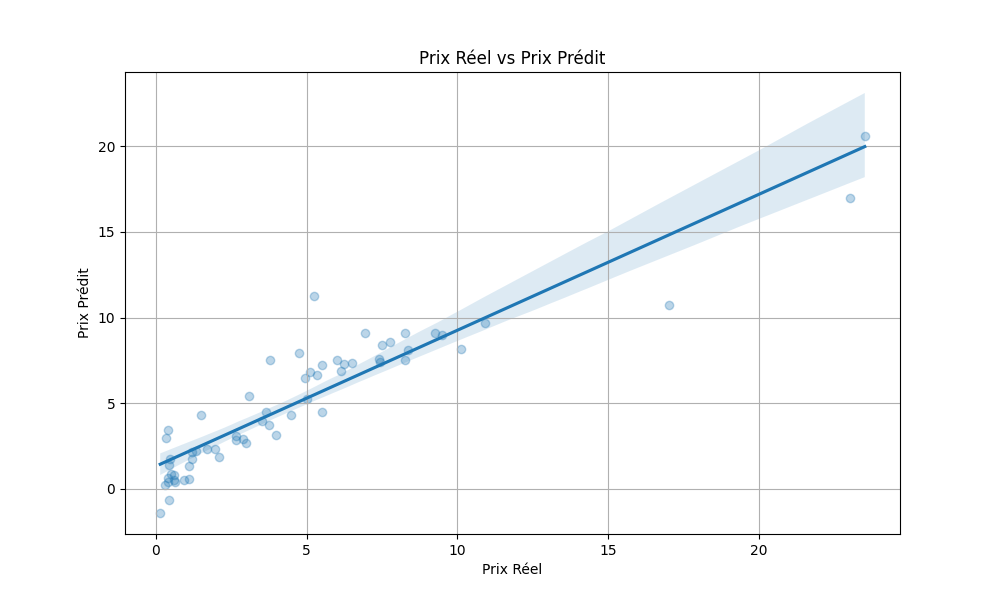

# Car Price Prediction with Machine Learning

This project has been enhanced to provide a robust and professional solution for used car price prediction. It uses machine learning techniques to estimate the selling price based on various features.

## Table of Contents

1.  Introduction
2.  Project Structure
3.  Data Preparation and Feature Engineering
4.  Model Training and Evaluation
5.  Model Usage
    *   Prediction via Python Script
    *   Prediction via Flask API
6.  Results Visualization
7.  Improvements Made
8.  Conclusion and Future Prospects

## 1. Introduction

The used car market is dynamic and complex, with prices influenced by a multitude of factors such as vehicle age, mileage, fuel type, and overall condition. This project aims to develop a linear regression model capable of accurately predicting the selling price of used cars, thus offering a valuable tool for buyers and sellers.

## 2. Project Structure

The repository contains the following files and directories:

*   `data/car data.csv`: The original dataset used for model training.
*   `car_price_prediction.py`: Python script for data preprocessing, linear regression model training, evaluation, and saving the trained model. It also generates a visualization plot.
*   `car_price_model.pkl`: The trained linear regression model, saved in pickle format, ready for predictions.
*   `app.py`: A Flask web application that exposes a RESTful API for car price prediction using the trained model.
*   `requirements.txt`: List of necessary Python dependencies to run the project.
*   `README.md`: This detailed documentation file.
*   `real_vs_predicted_prices.png`: Generated plot showing the relationship between actual and predicted prices by the model.
*   `test_api.py`: Python script for testing the Flask API.

## 3. Data Preparation and Feature Engineering

The `car data.csv` dataset contains information about various cars. Data preparation steps include:

*   **Data Loading**: The CSV file is loaded into a Pandas DataFrame.
*   **Feature Engineering**: A new feature, `Car_Age`, is created by subtracting the car\'s manufacturing year from the current year. This feature is crucial as a vehicle\'s age significantly impacts its price.
*   **Removal of Irrelevant Columns**: The `Car_Name` and `Year` columns are dropped because `Car_Name` is not directly usable by the model (too many unique categories) and `Year` is replaced by `Car_Age`.
*   **Categorical Variable Encoding**: Categorical variables such as `Fuel_Type`, `Selling_type`, and `Transmission` are converted to numerical format using one-hot encoding (`pd.get_dummies`). The `drop_first=True` option is used to avoid multicollinearity, which is a good practice in regression.

## 4. Model Training and Evaluation

A linear regression model is used to predict the selling price (`Selling_Price`).

*   **Data Splitting**: Data is split into training (80%) and testing (20%) sets to evaluate model performance on unseen data.
*   **Model Training**: The linear regression model is trained on the training set.
*   **Evaluation**: Model performance is evaluated using the R² coefficient of determination (`r2_score`). A high R² score indicates that the model explains a large portion of the variance in selling prices.
*   **Model Saving**: The trained model is saved in `pickle` format (`car_price_model.pkl`) for future use without needing to retrain it.

## 5. Model Usage

### Prediction via Python Script

You can use the trained model directly in a Python script to make predictions. Make sure you have the `car_price_model.pkl` file in the same directory or specify the correct path.

```python
import pickle
import pandas as pd
from datetime import datetime

def predict_car_price(present_price, driven_kms, fuel_type, selling_type, transmission, owner, year):
    model = pickle.load(open("car_price_model.pkl", "rb"))

    current_year = datetime.now().year
    car_age = current_year - year

    input_data = pd.DataFrame([[present_price, driven_kms, owner, car_age, 0, 0, 0, 0]],
                               columns=["Present_Price", "Driven_kms", "Owner", "Car_Age",
                                        "Fuel_Type_Diesel", "Fuel_Type_Petrol",
                                        "Selling_type_Individual", "Transmission_Manual"])

    if fuel_type == "Diesel":
        input_data["Fuel_Type_Diesel"] = 1
    elif fuel_type == "Petrol":
        input_data["Fuel_Type_Petrol"] = 1

    if selling_type == "Individual":
        input_data["Selling_type_Individual"] = 1

    if transmission == "Manual":
        input_data["Transmission_Manual"] = 1

    prediction = model.predict(input_data)[0]
    return prediction

# Example usage:
predicted_price = predict_car_price(
    present_price=8.0,
    driven_kms=50000,
    fuel_type=\'Petrol\',
    selling_type=\'Dealer\',
    transmission=\'Manual\',
    owner=0,
    year=2015
)
print(f"The predicted price for the car is: {predicted_price:.2f} lakhs")
```

### Prediction via Flask API

The project includes a Flask application (`app.py`) that provides an API for prediction. To start it:

1.  Ensure that the `car_price_model.pkl` model has been generated by running `car_price_prediction.py`.
    
2.  Run the Flask application:
    
    ```shell
    python app.py
    ```
    
3.  The API will be available at `http://0.0.0.0:5000`. You can send POST requests to the `/predict` endpoint with a JSON body containing the car\'s features. Example request (using `curl` or Postman):
    
    ```json
    {
        "Present_Price": 8.0,
        "Driven_kms": 50000,
        "Fuel_Type": "Petrol",
        "Selling_type": "Dealer",
        "Transmission": "Manual",
        "Owner": 0,
        "Year": 2015
    }
    ```
    
    The API will return a JSON response with the predicted price:
    
    ```json
    {
        "predicted_price": 5.50
    }
    ```

## 6. Results Visualization

The `car_price_prediction.py` script generates a regression plot (`real_vs_predicted_prices.png`) that visualizes the relationship between actual and predicted prices by the model. This allows for a visual assessment of the model\'s performance.



## 7. Improvements Made

Compared to the initial version, the following improvements have been implemented:

*   **Unified Code**: Data preprocessing, training, and evaluation code is now grouped into a single Python script (`car_price_prediction.py`) for better organization and execution.
*   **Robust Flask API**: The Flask application (`app.py`) has been enhanced with:
    *   Error handling for model loading.
    *   Input data validation to ensure all required fields are present and have the correct type.
    *   Error handling during prediction.
    *   A welcome message on the root route (`/`).
*   **Improved Documentation**: This `README.md` file provides comprehensive project documentation, including structure, usage steps, and technical details.
*   **Visualization**: A regression plot is generated for a better understanding of the model\'s performance.
*   **Code Cleanup**: The code has been reviewed to improve readability, modularity, and adherence to good programming practices.
*   **API Test Script**: Added a `test_api.py` script to facilitate testing of the Flask API.

## 8. Conclusion and Future Prospects

This project demonstrates a comprehensive approach to used car price prediction using machine learning. The trained model can be used as a reliable tool for price estimation.

**Future improvement prospects**:

*   **Additional Data Collection**: Adding more data, including information on accident history, vehicle condition, or model-specific features, could improve accuracy.
*   **Exploration of More Complex Models**: Trying other machine learning algorithms (e.g., Random Forest, Gradient Boosting) or neural networks to see if better performance can be achieved.
*   **Production Deployment**: Setting up a more robust deployment of the Flask API, potentially with Docker and a cloud service.
*   **User Interface**: Developing a web or mobile user interface to facilitate interaction with the model.

---

**Author**: Manus (AI Agent)
**Date**: August 12, 2025


